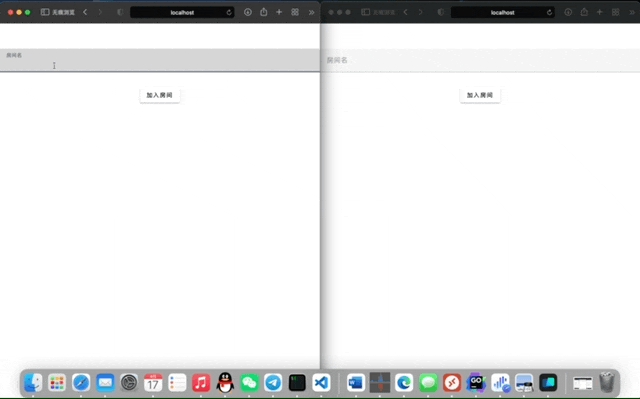
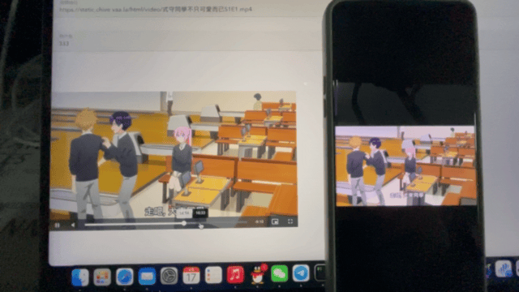

# 多人在线电影院

> 这是前端代码仓库，可执行文件请在这里下载 [https://github.com/VaalaCat/movie-sync/releases](https://github.com/VaalaCat/movie-sync/releases)

> 后端代码仓库，请访问 [https://github.com/VaalaCat/movie-sync-server](https://github.com/VaalaCat/movie-sync-server)

> 博客地址(实时更新)：[https://vaala.cat/2022/04/17/%E5%BC%82%E5%9C%B0%E5%A4%9A%E4%BA%BA%E5%9C%A8%E7%BA%BF%E7%94%B5%E5%BD%B1%E9%99%A2/](https://vaala.cat/2022/04/17/%E5%BC%82%E5%9C%B0%E5%A4%9A%E4%BA%BA%E5%9C%A8%E7%BA%BF%E7%94%B5%E5%BD%B1%E9%99%A2/)

## 引言

最近一段时间和npy异地，经常就会有一些一起看视频的需求，然鹅市面上视频共享的产品要么是因为版权的原因资源不足，要么是因为产品定位没有办法顾及到这种小众市场需求。

作为一个开发，遇到这种问题当然是决定要自己敲一个出来咯。

## 演示

 

 

## 产品调研

在准备自己动手之前，首先要分析市面上已有的方案有哪些，需要吸取经验和创意作为自己项目的feature。

在知乎和v2 reddit 以及油管上调研后发现，异地恋在线视频同步这种需求一般有如下几种解决方案：

* 打个电话喊321，最简单最直接的方案，不过遇到视频卡顿或者想要暂停和分享精彩镜头就有些麻烦了


* 各种**国外产品**，例如[syncTube](https://sync-tube.de/)，[twoseven](https://twoseven.xyz)等，这类产品能够同步的是Netflix或YouTube上的流媒体，在国内几乎没有受众，对我来说也是毫无用处。
* 各种**国内产品**，例如BiliBili一起看，微光等产品，这类产品也大都因为版权和产品定位原因，将视频源限制在站内，有些本地的电影或其它小站找到的资源并不能同步。
* 现有**国内开源项目**，各位大佬开发的[Coplay](https://github.com/Justineo/coplay)，[SyncSofa](https://github.com/LouisYLWang/Sync-Sofa)，前者许久未维护看起来是不可用的状态（作者没异地了似乎就不维护了岂可修），后者是作为浏览器插件运行，难以在手机上实现功能（并且这个作者似乎也是结束异地了岂可修）并且二者平台所限，也只能观看特定平台等内容。
* 现有**国外开源项目**，[SyncPlay](https://syncplay.pl/) ，产品依托于VLC，也只能在电脑上运行，难以移植到手机上。
* 对现有产品的魔改利用，例如有些同学用TeamViewer，腾讯会议，Zoom等视频会议和远程协作产品来实现一起观看，尝试过后发现因为国内网络环境问题，上行带宽不足，很难达到理想的效果。
* 额外分一个类：🍎iOS在15中公布了Universal Control和SharePlay，其理念非常符合需求，但现在并不能看出它的游戏，设备也是限定在了苹果生态内，并且也限定了资源源头，也希望库克能把这个产品发扬光大吧。

所以从已有的产品可以看出，我的需求是：

* 操作简单，无需登陆注册，点击即用，提高npy的使用体验，产品力强。
* 可以直接载入互联网流媒体资源，资源丰富，载入简单，跨平台，速度快体验良好。
* 跨平台，无论npy用的是什么设备，不用安装app和插件，可以无感接入，进度条拖到哪就是哪。

## 技术选型

从上面的需求来看，我最开始想到的是做一个直播推流控制服务器，由资源服务器将视频流通过hls或是rtmp协议传送到浏览器直接播放，跨平台，操作简单，技术成熟。但是实际测试后发现这种产品没有高质量CDN和OSS支撑难以达到好的体验，延迟巨大且不可靠，体验非常不好。

重新思考后我选择使用Web技术栈，做一个PWA，一个链接点开就能用，资源链接粘贴进去就可以开始。并且Web技术栈中有WebRTC和WebSocket这种长链接和数据对等共享技术，非常符合我们的需求。

基于个人情况，我选择的技术栈为

前端：

* 使用VideoJS加载第三方视频，API丰富，有事件驱动可以实现远端触发本地函数执行。可以加载mp4和webm以及ogg编码的第三方流媒体。
* 使用WebSocket作为前后端业务数据交换协议，长连接稳定可靠，事件驱动，容易实现多人数据同步（但目前看来有数据冲突，后期准备换用CRDT数据结构）。
* 使用Vue构建PWA，前后端分离，快速更换服务端降低延迟提升体验。
* Vuetify：Material Design，动画丰富，用户体验好。

后端：

* Golang：大道至简。
* Gin/Socketio：现成的，好用。

可以发现活都用在前端了（毕竟后端是给我自己看，前端是要给npy的，打算做一个无状态服务，轻量，所以就不用数据库了，启动一次用一次。

## 逻辑设计

对npy来说，想的是随时可以暂停，随时可以拖进度条，而且由于网络环境，她网络经常卡，所以要做自动同步和自动重连，用事件驱动的逻辑我们很好就能设计出原型，我们设计以下事件并定义事件的行为：

* `getUsers`：客户端每次发起该请求，服务器便回复`allUsers` 事件并附上所有用户。
* `allUsers`：客户端接收到该事件，需要更新本地显示的用户列表。
* `Null`：客户端发起`getUsers` 请求，如果该房间没有用户，则返回`Null` ，前端切换到房间创建模式。
* `time`：客户端发起该请求，服务端收到时间后将服务端保存的该客户端时间进度记录，并查找当前房间所有客户端的时间进度，找出最大和最小值，使用`sync` 事件将两个时间广播到该房间。
* `sync`：客户端收到该事件，需要自行选择更新到最小还是最大时间，并且为了防止网络波动造成的小延迟，只有在差距大于一定值时才选择进行更新，这里我选择只向前更新。
* `setTime`：客户端发送该请求，客户端同时接收该事件，当进度条被拖动，`VideoJS` 的`timeupdate` 会超过250毫秒，每当超过1秒就发送该请求到服务端，并附上新的时间，服务端对该请求进行广播，让房间内所有客户端都设定到该时间，
* `getTime`：客户端发送该请求，客户端同时接收该事件，发送时会由服务端进行广播，收到该请求的所有客户端会回复`time` 事件，触发服务端广播的`sync`，从而实现房间进度同步。

看起来略有混乱，我甚至不知道能不能跑起来（最后确实是跑起来了甚至跑的不错。

不过这只是一个原型，后期打算使用CRDT进行重构。

## 使用帮助

大家最关心的也许是这个吧，因为是一个Web项目，所以需要一台服务器，这是肯定的吧，并且资源的来源是第三方流媒体，所以流畅程度并不取决于服务器的带宽，服务器只用来做进度条数据的同步，可以说负载非常的低，10Kb网络都不会有问题，也可以实现毫秒级的同步。为了方便部署，我将项目编译到了Release，需要的同学可以自行下载，（这里可以开开脑洞使用树莓派或者软路由做DDNS或者内网穿透运行起来

首先我们需要分别下载前端和后端文件，

* 前端：<https://github.com/VaalaCat/movie-sync/releases>
* 后端：

下载完成后在服务端创建文件夹，结构为：

```
ProjectDir
├── asset # 下载好的前端文件放在这里吗
│   ├── css
│   ├── favicon.ico
│   ├── fonts
│   ├── index.html
│   └── js
└── movie-sync-server # 后端文件放在这里
    ├── .env # 该文件需要手动创建
    └── movie-sync-server
```

然后我们编辑后端文件夹中的`.env` 文件，内容为：

```
PORT=8000
ALLOW_ORIGIN=http://localhost:8000
```

这里的端口就是程序将监听的端口，后面的`ALLOW_ORIGIN`要改为**客户端浏览器中访问时显示的地址**，不用添加后面的路径，因为有些时候会经过Nginx之类的反向代理，所以链接可能会变成其他样子。修改完成后保存文件，然后就可以直接运行了，切换到后端文件夹：

```bash
cd ProjectDir/movie-sync-server
chmod +x movie-sync-server && ./movie-sync-server
```

如果你看到了这样的东西，说明已经成功运行

```
[GIN-debug] [WARNING] Running in "debug" mode. Switch to "release" mode in production.
 - using env:   export GIN_MODE=release
 - using code:  gin.SetMode(gin.ReleaseMode)

[GIN-debug] GET    /socket.io/*any           --> github.com/gin-gonic/gin.WrapH.func1 (2 handlers)
[GIN-debug] POST   /socket.io/*any           --> github.com/gin-gonic/gin.WrapH.func1 (2 handlers)
[GIN-debug] GET    /                         --> main.main.func12 (2 handlers)
[GIN-debug] GET    /movie                    --> github.com/gin-gonic/gin.(*RouterGroup).StaticFile.func1 (2 handlers)
[GIN-debug] HEAD   /movie                    --> github.com/gin-gonic/gin.(*RouterGroup).StaticFile.func1 (2 handlers)
[GIN-debug] GET    /movie/login              --> github.com/gin-gonic/gin.(*RouterGroup).StaticFile.func1 (2 handlers)
[GIN-debug] HEAD   /movie/login              --> github.com/gin-gonic/gin.(*RouterGroup).StaticFile.func1 (2 handlers)
[GIN-debug] GET    /movie/css/*filepath      --> github.com/gin-gonic/gin.(*RouterGroup).createStaticHandler.func1 (2 handlers)
[GIN-debug] HEAD   /movie/css/*filepath      --> github.com/gin-gonic/gin.(*RouterGroup).createStaticHandler.func1 (2 handlers)
[GIN-debug] GET    /movie/js/*filepath       --> github.com/gin-gonic/gin.(*RouterGroup).createStaticHandler.func1 (2 handlers)
[GIN-debug] HEAD   /movie/js/*filepath       --> github.com/gin-gonic/gin.(*RouterGroup).createStaticHandler.func1 (2 handlers)
[GIN-debug] GET    /movie/room/*any          --> main.main.func13 (2 handlers)
[GIN-debug] [WARNING] You trusted all proxies, this is NOT safe. We recommend you to set a value.
Please check https://pkg.go.dev/github.com/gin-gonic/gin#readme-don-t-trust-all-proxies for details.
[GIN-debug] Listening and serving HTTP on :8000
```

现在访问链接`http://localhost:8000` 即可开始使用